# Informe Entrega 1 - Bases de datos IIC2413

### Datos del Alumno
| **Apellidos**       | **Nombres**          | **Número de Alumno** |
|---------------------|----------------------|----------------------|
| Díaz Edwards| Santiago Rowdrigo    |2362776J              |

### 1. Modelo Entidad-Relación (E/R)
<!-- Inserta aquí tu diagrama ER. Usa el formato svg para evitar la perdida de calidad. Reemplaza "diagrama.svg" por la ruta a tu archivo -->

### 2. Entidades Débiles
<!-- Justifica CADA entidad débil identificada  -->

#### 2.1 PLAN_ISAPRE (débil respecto de INSTITUCION_SALUD)
**Por qué es débil:** su existencia depende de una ISAPRE específica y su identidad se compone con la clave de esa ISAPRE más el grupo del arancel.  
No tiene identidad propia fuera de la institución; el “plan” único de cada ISAPRE se materializa como filas por grupo con su bonificación.  
**Regla:** Cada ISAPRE tiene un solo plan… que especifica el porcentaje por cada grupo.  

- **Clave parcial:** grupo  
- **Clave total (PK):** (cod_ministerial, grupo)

#### 2.2 RECETA_ITEM (débil respecto de RECETA)
**Por qué es débil:** no existe sin su RECETA; cada ítem solo se identifica dentro de la receta a la que pertenece, y referencia un medicamento del Maestro de farmacia.  
**Regla:** Una receta especifica un conjunto de medicamentos… psicotrópicos en receta separada con código de autorización único.  

- **Clave parcial:** cod_generico  
- **Clave total (PK):** (id_receta, cod_generico)

#### 2.3 ORDEN_ITEM (débil respecto de ORDEN)
**Por qué es débil:** no existe sin su ORDEN; cada ítem solo se identifica dentro de la orden a la que pertenece, y referencia una prestación del Arancel FONASA (identificada por codigo + codigo_adicional).  
**Regla:** Una orden especifica los exámenes/procedimientos… registrados en el Arancel FONASA

- **Clave parcial:** (codigo, codigo_adicional)  
- **Clave total (PK):** (id_orden, codigo, codigo_adicional)

---

### 3. Llaves Primarias  y Compuestas
<!-- Justifica TODAS las llaves: primaria simple y primaria compuesta -->

#### 3.1 PERSONA
La llave primaria de **PERSONA** es **run** porque es una clave  única; evita duplicidad de personas.

#### 3.2 TRABAJADOR / PACIENTE
La llave primaria de **TRABAJADOR / PACIENTE** es **run**, heredada 1:1 desde PERSONA; asegura correspondencia exacta por rol, consistente con “una persona puede ser paciente, trabajador o ambos”.

#### 3.3 MEDICO / ADMINISTRATIVO
La llave primaria de **MEDICO / ADMINISTRATIVO** es **run**. Son subtipos disjuntos de TRABAJADOR; mantiene separadas las restricciones y permite que solo MEDICO esté en relaciones de atención/receta/orden.

#### 3.4 INSTITUCION_SALUD
La llave primaria de **INSTITUCION_SALUD** es **cod_ministerial**, una clave natural provista por el dominio que distingue ISAPRE/FONASA.

#### 3.5 AFILIACION
La llave primaria compuesta de **AFILIACION** es (**run**, **cod_ministerial**) porque identifica de forma no ambigua la afiliación de una persona a una única institución.  

Restricción clave adicional: **UNIQUE(run)** para hacer cumplir “un beneficiario solo puede estar registrado en una institución”. (Cuando `condicion = 'beneficiario'`, **run_titular** referencia al titular).

#### 3.6 PLAN_ISAPRE
La llave primaria compuesta de **PLAN_ISAPRE** es (**cod_ministerial**, **grupo**) porque cada ISAPRE define una bonificación por grupo; la combinación es única y suficiente.

#### 3.7 MAESTRO_FARMACIA
La llave primaria de **MAESTRO_FARMACIA** es **cod_generico**, clave de catálogo que identifica de forma única cada medicamento genérico.

#### 3.8 ARANCEL_FONASA
La llave primaria compuesta de **ARANCEL_FONASA** es (**codigo**, **codigo_adicional**) porque el arancel usa ambas columnas como identificador natural de la prestación.

#### 3.9 ARANCEL_DCCOLITA
La llave primaria de **ARANCEL_DCCOLITA** es **codigo_interno**, identificador propio del centro médico.  

Llave foránea compuesta: (**codigo**, **codigo_adicional**) que referencia a **ARANCEL_FONASA**, para mapear cada código interno a la prestación FONASA correspondiente (regla de cobro: FONASA vs. particular).

#### 3.10 CONSULTA
La llave primaria de **CONSULTA** es **id_consulta**, un surrogate/serial práctico para eventos temporales; evita PKs largas y facilita auditoría.  

La relación con **MEDICO** y **PACIENTE** respeta la regla de que “toda atención comienza con una consulta y solo los médicos realizan consultas”.

#### 3.11 RECETA
La llave primaria de **RECETA** es **id_receta**, surrogate.  

Restricción adicional: **codigo_autorizacion** debe ser único y obligatorio cuando `tipo_receta = 'psicotropicos'`, de acuerdo con el enunciado.

#### 3.12 RECETA_ITEM
La llave primaria compuesta de **RECETA_ITEM** es (**id_receta**, **cod_generico**) porque un medicamento no puede repetirse dentro de la misma receta; depende de la receta y del ítem del maestro

#### 3.13 ORDEN
La llave primaria de **ORDEN** es **id_orden**, surrogate.

#### 3.14 ORDEN_ITEM
La llave primaria compuesta de **ORDEN_ITEM** es (**id_orden**, **codigo**, **codigo_adicional**) porque una prestación no se repite dentro de la misma orden; además, referencia al par identificador de **FONASA**

---

### 4. Relaciones
<!-- Justifica TODAS las relaciones de tu modelo -->

#### 4.1 Jerarquías de roles de persona
- **PERSONA — PACIENTE (subtipo):** modela que una persona puede (o no) ser paciente; todo PACIENTE “es una” PERSONA (PK–FK por run).  
  Captura la regla: “una persona puede ser paciente, trabajar en el centro médico o ambos” (RN-1).

- **PERSONA — TRABAJADOR (subtipo) y TRABAJADOR — (MÉDICO, ADMINISTRATIVO):** especialización disjunta de TRABAJADOR en MÉDICO o ADMINISTRATIVO (solo uno de los dos).  
  Permite reflejar que “los trabajadores se dividen en staff médico o administrativo” y que “solo los médicos realizan consultas, emiten recetas y órdenes” (RN-1 y RN-2).

#### 4.2 Afiliación previsional
- **INSTITUCION_SALUD — AFILIACION — PERSONA:** AFILIACION une a una PERSONA con una institución (ISAPRE/FONASA) o ninguna, según RN-4.  
  El atributo `condicion ∈ {titular, beneficiario}` y `run_titular` permiten capturar RN-5 (“beneficiario” referencia a su titular).

- **INSTITUCION_SALUD — PLAN_ISAPRE:** por cada ISAPRE se define un plan por grupo FONASA con su % bonificación, cumpliendo RN-7.

#### 4.3 Atenciones médicas
- **MÉDICO — CONSULTA — PACIENTE:** una consulta la atiende exactamente un médico y la recibe exactamente un paciente; es el “origen” de recetas y órdenes (RN-6).

- **CONSULTA — RECETA** y **CONSULTA — ORDEN:** desde una consulta se pueden generar 0..n recetas y 0..n órdenes (RN-6).

#### 4.4 Detalle de recetas y órdenes
- **RECETA — RECETA_ITEM — MAESTRO_FARMACIA:** cada receta incluye ítems que referencian medicamentos del maestro (código genérico).  
  El campo `tipo_receta` y `codigo_autorizacion` modelan el caso psicotrópicos: deben ir en receta independiente y con código único (enunciado).

- **ORDEN — ORDEN_ITEM — ARANCEL_FONASA:** cada orden incluye ítems de procedimientos/exámenes codificados por FONASA (código + adicional), según RN-6.

- **ARANCEL_DCCOLITA — ARANCEL_FONASA:** cada prestación interna mapea a una prestación FONASA (código + adicional).  
  Esto permite cobrar por FONASA si corresponde o por el valor particular del centro.

---

### 5. Cardinalidades
<!-- Explica la cardinalidad en CADA relación del modelo -->

#### 5.1 Jerarquías
- **PERSONA — PACIENTE:** (1 — 0..1).  
  Cada PACIENTE tiene exactamente 1 PERSONA; una PERSONA puede o no ser PACIENTE (RN-1).

- **PERSONA — TRABAJADOR:** (1 — 0..1).  
  Un TRABAJADOR siempre es una PERSONA; una PERSONA puede no ser TRABAJADOR (RN-1).

- **TRABAJADOR — MÉDICO:** (1 — 0..1), disjunto de ADMINISTRATIVO.  
  Todo MÉDICO es TRABAJADOR y, por disyunción, un TRABAJADOR es o MÉDICO o ADMINISTRATIVO (RN-1/RN-2).

- **TRABAJADOR — ADMINISTRATIVO:** (1 — 0..1), disjunto de MÉDICO.

#### 5.2 Afiliación y planes
- **PERSONA — AFILIACION (“tiene afiliación”):** (1 — 0..1).  
  Una persona puede estar afiliada a lo más una institución o ser particular (RN-4).

- **INSTITUCION_SALUD — AFILIACION:** (1 — 0..n).  
  Cada institución puede tener muchos afiliados (RN-4).

- **PERSONA — AFILIACION (“es titular de”):** (1 — 0..n) sobre los beneficiarios.  
  Cada beneficiario referencia exactamente 1 titular; un titular puede tener n beneficiarios (RN-5).

- **INSTITUCION_SALUD — PLAN_ISAPRE:** (1 — 0..n).  
  Para ISAPRE, hay una fila por grupo FONASA con su bonificación (todas las personas de esa ISAPRE comparten el plan), cumpliendo RN-7.

#### 5.3 Consultas, recetas y órdenes
- **MÉDICO — CONSULTA:** (1 — 0..n).  
  Un médico atiende muchas consultas; cada consulta tiene exactamente 1 médico (RN-2/RN-6).

- **PACIENTE — CONSULTA:** (1 — 0..n).  
  Un paciente puede tener muchas consultas; cada consulta pertenece a exactamente 1 paciente (RN-6).

- **CONSULTA — RECETA:** (1 — 0..n).  
  Una consulta puede generar múltiples recetas; cada receta pertenece a 1 consulta (RN-6).

- **CONSULTA — ORDEN:** (1 — 0..n).  
  Análogo para órdenes (RN-6).

#### 5.4 Detalles y catálogos
- **RECETA — RECETA_ITEM:** (1 — 1..n).  
  Una receta tiene uno o más ítems; cada ítem pertenece a 1 receta.

- **MAESTRO_FARMACIA — RECETA_ITEM:** (1 — 0..n).  
  Un medicamento puede aparecer en muchas recetas.

- **ORDEN — ORDEN_ITEM:** (1 — 1..n).  
  Una orden tiene uno o más ítems.

- **ARANCEL_FONASA — ORDEN_ITEM:** (1 — 0..n).  
  Una prestación FONASA puede ser solicitada en muchas órdenes.

- **ARANCEL_FONASA — ARANCEL_DCCOLITA:** (1 — 0..n).  
  Una prestación FONASA puede tener varios códigos internos del centro (o ninguno); cada registro interno referencia exactamente 1 (código + adicional) de FONASA.

**Notas relacionadas con el enunciado:**
- Las consultas son el punto de partida de recetas y órdenes (RN-6).  
- ISAPRE tiene un único “plan por grupo” (no por persona), modelado con `PLAN_ISAPRE(cod_ministerial, grupo, bonificación)` (RN-7).  
- Para psicotrópicos la receta es separada con código de autorización único, representado por `RECETA.tipo_receta` y `RECETA.codigo_autorizacion`.  

---

### 6. Jerarquías
<!-- Identifica y justifica TODAS las jerarquías -->

#### 6.1 PERSONA – PACIENTE – TRABAJADOR
Se modela una jerarquía donde **PERSONA** es la entidad padre y **PACIENTE** y **TRABAJADOR** heredan de ella.

**Justificación:**
- **Especialización parcial y superpuesta:** una PERSONA puede no tener rol (0..1 hacia cada subtipo), puede ser solo PACIENTE, solo TRABAJADOR o ambos (p. ej., un médico que también se atiende en la clínica).
- **Aislamiento de atributos y reglas por rol:** atributos/acciones propias del paciente (historial de consultas) o del trabajador (relación laboral) no “ensucian” PERSONA con nulos o campos que no aplican.
- **Integridad referencial clara:** las relaciones clínicas **CONSULTA** referencian a **PACIENTE** y, a nivel de atención, a **MÉDICO** 
- **Claves:** los subtipos heredan la PK **run** de PERSONA (1:1), manteniendo identidad única en todo el dominio.

#### 6.2 TRABAJADOR – MÉDICO – ADMINISTRATIVO
Se modela una jerarquía donde **TRABAJADOR** es la entidad padre y **MÉDICO** y **ADMINISTRATIVO** heredan de ella.

**Justificación:**
- **Especialización total y disjunta:** todo TRABAJADOR debe ser exactamente uno de los subtipos (totalidad) y los conjuntos no se solapan (disyunción). Esto refleja la separación operacional del centro: o ejerce labores clínicas (**MÉDICO**) o de apoyo/gestión (**ADMINISTRATIVO**).
- **Políticas de negocio y permisos:** solo **MÉDICO** puede figurar como responsable en **CONSULTA/RECETA/ORDEN**; **ADMINISTRATIVO** no participa en esas relaciones clínicas.
- **Atributos específicos:** *especialidad* aplica solo a **MÉDICO**; *cargo* solo a **ADMINISTRATIVO**, evitando nulos en una tabla única.
- **Claves:** ambos subtipos heredan **run** desde TRABAJADOR (1:1), preservando identidad sin redundancia.

> **Nota sobre el diagrama:** Use Mermaid ER no representa directamente los constraints “disjunta/solapada” ni “total/parcial” con notación clásica; por eso se declaran explícitamente en esta sección y se refuerzan en el esquema relacional (p. ej., con checks/índices/triggers) para que el modelo quede a prueba de inconsistencias.

---

### 7. Esquema Relacional
<!-- Construye el esquema relacional a partir de tu Modelo E/R -->

**PERSONA**( <u>run</u>: TEXT, nombres: TEXT, apellidos: TEXT, telefono: TEXT, email: TEXT, direccion: TEXT )

**TRABAJADOR**( <u>run</u>: TEXT [FK→PERSONA.run] )

**MEDICO**( <u>run</u>: TEXT [FK→TRABAJADOR.run], especialidad: TEXT )

**ADMINISTRATIVO**( <u>run</u>: TEXT [FK→TRABAJADOR.run], cargo: TEXT )

**PACIENTE**( <u>run</u>: TEXT [FK→PERSONA.run] )

**INSTITUCION_SALUD**( <u>cod_ministerial</u>: TEXT, nombre: TEXT, naturaleza: TEXT /* ISAPRE|FONASA */, tipo: TEXT /* abierta|cerrada, NULL si FONASA */, rut: TEXT, enlace: TEXT )

**AFILIACION**( <u>run</u>: TEXT [FK→PERSONA.run], <u>cod_ministerial</u>: TEXT [FK→INSTITUCION_SALUD.cod_ministerial], condicion: TEXT, run_titular: TEXT [FK→PERSONA.run] )

**PLAN_ISAPRE**( <u>cod_ministerial</u>: TEXT [FK→INSTITUCION_SALUD.cod_ministerial], <u>grupo</u>: TEXT, bonificacion: INT )

**MAESTRO_FARMACIA**( <u>cod_generico</u>: TEXT, nombre: TEXT, descripcion: TEXT, tipo: TEXT, cod_onu: TEXT, clasif_onu: TEXT, clasif_interna: TEXT, estado: TEXT, canasta_esencial: BOOLEAN, precio: NUMERIC )

**ARANCEL_FONASA**( <u>codigo</u>: TEXT, <u>codigo_adicional</u>: TEXT, descripcion: TEXT, grupo: TEXT, tipo: TEXT, valor_fonasa: NUMERIC )

**ARANCEL_DCCOLITA**( <u>codigo_interno</u>: TEXT, codigo: TEXT, codigo_adicional: TEXT, descripcion: TEXT, valor_particular: NUMERIC )  
&nbsp;&nbsp;FK compuesta: (codigo, codigo_adicional) [FK→ARANCEL_FONASA.(codigo, codigo_adicional)]

**CONSULTA**( <u>id_consulta</u>: BIGINT, fecha_hora: TIMESTAMP, diagnostico: TEXT, medico_run: TEXT [FK→MEDICO.run], paciente_run: TEXT [FK→PACIENTE.run] )

**RECETA**( <u>id_receta</u>: BIGINT, id_consulta: BIGINT [FK→CONSULTA.id_consulta], tipo_receta: TEXT, codigo_autorizacion: TEXT )

**RECETA_ITEM**( <u>id_receta</u>: BIGINT [FK→RECETA.id_receta], <u>cod_generico</u>: TEXT [FK→MAESTRO_FARMACIA.cod_generico], indicacion: TEXT, dosis: TEXT, frecuencia: TEXT, duracion: TEXT )

**ORDEN**( <u>id_orden</u>: BIGINT, id_consulta: BIGINT [FK→CONSULTA.id_consulta], observacion: TEXT )

**ORDEN_ITEM**( <u>id_orden</u>: BIGINT [FK→ORDEN.id_orden], <u>codigo</u>: TEXT, <u>codigo_adicional</u>: TEXT, indicacion: TEXT )  
&nbsp;&nbsp;FK compuesta: (codigo, codigo_adicional) [FK→ARANCEL_FONASA.(codigo, codigo_adicional)]

#### Transformación E/R → Relacional (qué se vuelve tabla y por qué)
- **Entidades fuertes → tablas:** `PERSONA`, `INSTITUCION_SALUD`, `MAESTRO_FARMACIA`, `ARANCEL_FONASA`, `ARANCEL_DCCOLITA`.
- **Subtipos 1:1 → tablas separadas:** `TRABAJADOR`, `MEDICO`, `ADMINISTRATIVO`, `PACIENTE` (evitan nulos y concentran reglas por rol).
- **Entidades/relaciones asociativas → tablas con PK compuesta:** `AFILIACION(run, cod_ministerial)` para persona–institución.
- **Hechos/Documentos → tablas con surrogate:** `CONSULTA`, `RECETA`, `ORDEN` (trazabilidad temporal, PK corta).
- **Detalles (multivaluados) → tablas débiles con PK compuesta:** `RECETA_ITEM`, `ORDEN_ITEM`.

#### Llaves foráneas y “delegadas” (surrogate) usadas y justificación
- **Surrogates:** `id_consulta`, `id_receta`, `id_orden` (eventos secuenciales; facilitan auditoría y referencias).
- **Naturales donde existen:** `run`, `cod_ministerial`, `(codigo, codigo_adicional)`, `cod_generico` (estables y significativas).
- **FKs clave:**
  - `CONSULTA.medico_run → MEDICO.run`, `CONSULTA.paciente_run → PACIENTE.run`.
  - `RECETA.id_consulta → CONSULTA.id_consulta`, `ORDEN.id_consulta → CONSULTA.id_consulta`.
  - `RECETA_ITEM.cod_generico → MAESTRO_FARMACIA.cod_generico`.
  - `ORDEN_ITEM.(codigo,codigo_adicional) → ARANCEL_FONASA`.
  - `ARANCEL_DCCOLITA.(codigo,codigo_adicional) → ARANCEL_FONASA`.
  - `AFILIACION.run → PERSONA.run`, `AFILIACION.cod_ministerial → INSTITUCION_SALUD.cod_ministerial`.

---

### 8. Consistencia y Normalización en BCNF
<!-- Justifica la consistencia del esquema y su cumplimiento de BCNF -->

- **Consistencia:**
  - **Identidad única y estable:** todas las entidades tienen PK clara (naturales cuando existen: `run`, `cod_ministerial`, `(codigo, codigo_adicional)`, `cod_generico`; y surrogates para eventos: `id_consulta`, `id_receta`, `id_orden`), evitando duplicados y facilitando auditoría.
  - **Cardinalidades vía FK/UNIQUE:**
    - **AFILIACION:** `UNIQUE(run)` asegura a lo más una institución por persona; la PK compuesta `(run, cod_ministerial)` evita repetidos.
    - **RECETA_ITEM** y **ORDEN_ITEM:** PKs compuestas impiden repetir el mismo ítem dentro de una receta/orden.
    - **PLAN_ISAPRE(cod_ministerial, grupo):** una fila por grupo garantiza un único porcentaje por `ISAPRE+grupo`.
  - **Integridad referencial completa:** todas las relaciones clave están protegidas con FK (p. ej., `CONSULTA.medico_run → MEDICO.run`, `ARANCEL_DCCOLITA → ARANCEL_FONASA(codigo, codigo_adicional)`), evitando “órdenes/recetas huérfanas” o referencias a catálogos inexistentes.
  - **Dominio y reglas de negocio con CHECK/índices:**
    - **Dominios enumerados:** `naturaleza IN ('ISAPRE','FONASA')`, `tipo IN ('abierta','cerrada') OR tipo IS NULL` (NULL solo si `naturaleza='FONASA'`), `tipo_receta IN ('normal','psicotropicos')`.
    - **Rangos válidos:** `bonificacion ∈ [0,100]`, montos monetarios `≥ 0`.
    - **Lógica de psicotrópicos:** `codigo_autorizacion` obligatorio y único solo cuando `tipo_receta='psicotropicos'`.
  - **Eliminación/actualización segura:** cascadas solo donde corresponde a “detalle de cabecera” (**RECETA_ITEM**, **ORDEN_ITEM**); catálogos se protegen con `RESTRICT` para no perder historia.
  - **No-redundancia semántica:**
    - Los precios/bonificaciones viven una sola vez (en **ARANCEL_FONASA**, **ARANCEL_DCCOLITA**, **PLAN_ISAPRE**); las **CONSULTA/ORDEN/RECETA** referencian catálogos en vez de copiar valores, evitando inconsistencias.
    - La jerarquía **PERSONA–(PACIENTE/TRABAJADOR)** separa atributos por rol y elimina nulos sistemáticos.
  - **Reglas transversales (vía trigger si se exige máxima rigurosidad):**
    - Si `AFILIACION.condicion='beneficiario'` ⇒ `(run_titular, cod_ministerial)` debe existir con `condicion='titular'` en la **misma** institución.
    - No mezclar fármacos de tipo “Psicotrópicos” con otros en la misma **RECETA** cuando `tipo_receta='psicotropicos'`.
    - Si un MÉDICO también es PACIENTE ⇒ su **AFILIACION** debe tener `condicion='titular'` (RN-3).

- **Normalización en BCNF:**
  - **Definición usada:** para toda dependencia funcional no trivial `X → Y` en una relación, `X` es superclave.
  - **Tablas con clave natural/simple (BCNF):**  
    **PERSONA(run)**, **TRABAJADOR(run)**, **PACIENTE(run)**, **MEDICO(run) → especialidad**, **ADMINISTRATIVO(run) → cargo**, **INSTITUCION_SALUD(cod_ministerial)**, **MAESTRO_FARMACIA(cod_generico)**, **ARANCEL_DCCOLITA(codigo_interno)**, **CONSULTA(id_consulta)**, **RECETA(id_receta)**, **ORDEN(id_orden)**.  
    En todas, los atributos no clave dependen solo de la PK y no hay dependencias adicionales.
  - **Claves compuestas (BCNF sin dependencias parciales):**
    - **ARANCEL_FONASA(codigo, codigo_adicional)** → {`descripcion`, `grupo`, `tipo`, `valor_fonasa`} (toda la fila depende del **par**; no hay dependencia parcial).
    - **PLAN_ISAPRE(cod_ministerial, grupo)** → `bonificacion` (la bonificación se determina exactamente por **ISAPRE+grupo**).
    - **RECETA_ITEM(id_receta, cod_generico)** → {`indicacion`, `dosis`, `frecuencia`, `duracion`}.
    - **ORDEN_ITEM(id_orden, codigo, codigo_adicional)** → {`indicacion`}.  
      Cada detalle depende de **toda** su PK (sin repetidos ni atributos que dependan de parte de la clave).
  - **Caso especial AFILIACION:**  
    PK `(run, cod_ministerial) → {condicion, run_titular}`. Además, por `UNIQUE(run)` se induce la DF `run → cod_ministerial`; por tanto **run también es superclave** (candidato alternativo). Todas las DFs tienen superclave a la izquierda ⇒ **BCNF**.
  - **Sin dependencias transitivas relevantes:** los atributos descriptivos o de monto viven en los catálogos; las tablas de hechos solo guardan claves/atributos propios del evento.
  - **Sin multivaluados ni grupos repetidos:** las colecciones están en tablas detalle (`*_ITEM`), garantizando 1NF; al depender completamente de sus PKs, alcanzan **BCNF**.

**Conclusión:** el esquema elimina redundancia estructural y evita anomalías como las vistas en clases. Las pocas reglas “entre filas/tablas” que exceden FDs se resuelven con restricciones y o triggers,sin romper BCNF. Me muero lo largo que fue esta entrega. :o :(