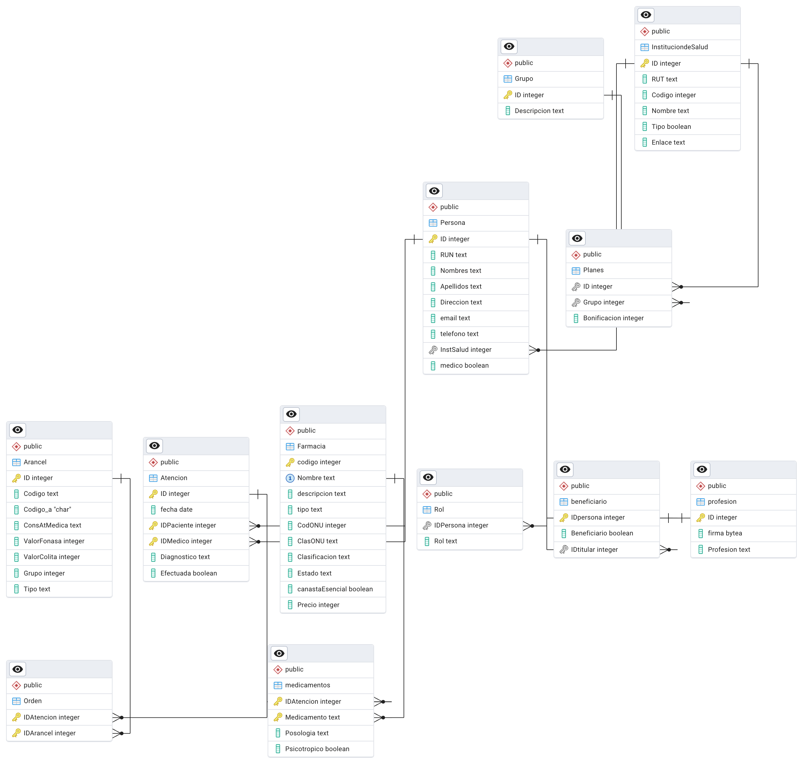
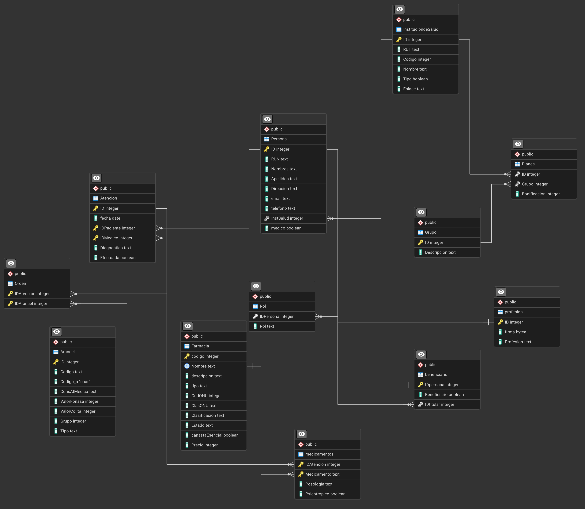

# Entrega Número 2  
**Alumno:** Santiago Díaz Edwards  
**Número de alumno:** 2362776J  

---

## Descripción General  
Este documento corresponde a la Entrega N°2 del curso *Bases de Datos*.  
Aquí se registrarán los pasos realizados, comandos ejecutados, configuraciones y resultados obtenidos durante el desarrollo del proyecto, incluyendo la importación del DUMP, la generación del esquema relacional y las consultas posteriores.

---

## 2.1 Modelo Entidad-Relación (E-R)  

### Esquema Relacional Extraído

El siguiente diagrama corresponde al modelo Entidad-Relación (E/R) generado a partir de la base de datos `dc_colita` utilizando la herramienta ERD Tool de pgAdmin 4 como se solicitó en el enunciado.  
Incluye todas las tablas, atributos, llaves primarias y foráneas definidas en la instancia.
Ambos son imágenes del mismo diagrama, pero en diferentes distribuciones para poder verse/entenderse mejor.

---

## 2.2 Preguntas (Consultas SQL)

### Pregunta 1 — Estadísticas de Pacientes

**a)** `beneficiariosporinstitucion.sql`  
Consulta que genera una estadística agrupada por institución de salud previsional, mostrando el número total de beneficiarios titulares y no titulares que son pacientes del centro médico.  

**b)** `beneficiariosnocliente.sql`  
Reporte que lista a las personas titulares que son pacientes del centro médico pero que poseen al menos un beneficiario que no es paciente  

Los resultados de ambas consultas se encuentran en la carpeta  
`Consultas-SQL/Pregunta-1/` en los archivos:

- `beneficiariosporinstitucion.txt`
- `beneficiariosnocliente.txt`

---
### Pregunta 2 — Estadísticas de Atenciones  

**a)** `top5dx.sql`  
Consulta que determina los 5 pacientes con mayor número de diagnósticos distintos, utilizando el texto del atributo `Atencion."Diagnostico"`.  
Se aplica `COUNT(DISTINCT "Diagnostico")` y se calcula un umbral mediante `ROW_NUMBER()` para incluir todos los empates del quinto puesto.  
El umbral obtenido fue **3**, por lo que se listan todos los pacientes con tres diagnósticos distintos.  

**b)** `top5farma.sql`  
Consulta que obtiene los 5 pacientes con mayor número de recetas que contienen el mismo medicamento, incluyendo los empates del quinto lugar.  

**Lógica aplicada:**  
- Se cuentan cuántas veces cada medicamento fue recetado a cada paciente.  
- Para cada paciente se obtiene el número máximo de repeticiones (`max_veces`).  
- Se calcula el umbral del quinto lugar (el valor mínimo dentro del top 5) para incluir a todos los empatados.  
- Finalmente, se muestran los medicamentos que alcanzan ese máximo por paciente.  

Esta versión utiliza funciones de ventana (`MAX() OVER (PARTITION BY ...)`) para simplificar la consulta y eliminar subconsultas innecesarias, haciendo el código más claro y eficiente.  

El umbral obtenido fue 1, con solo tres pacientes que tuvieron 2 repeticiones del mismo medicamento.  

Los resultados se encuentran en:  
- `Consultas-SQL/Pregunta-2/top5dx.txt`  
- `Consultas-SQL/Pregunta-2/top5farma.txt`

---

### Pregunta 3 — Asistencias Perdidas  

-`Consultas-SQL/Pregunta-3/asistenciasperdidas.sql`

Informe que presenta tres partes:  
1. **Número mensual** de atenciones no efectuadas (`Efectuada = false`),  
2. **Top 5 médicos** con mayor promedio mensual de atenciones perdidas,  
3. **Top 5 pacientes** con mayor promedio mensual de atenciones perdidas.  
**Lógica aplicada:**  
- Se consolidaron las atenciones por `ID`, aplicando `BOOL_OR("Efectuada")` para considerar realizada cualquier atención que tuviera al menos un registro con `true`.  
- Luego se calcularon los promedios mensuales de ausencias para cada médico y paciente, utilizando `RANK()` para incluir empates.  

Los resultados se encuentran en:  
- `Consultas-SQL/Pregunta-3/asistenciasperdidas.txt`

---
### Pregunta 4 — Medicamentos y Exámenes más Recetados  
**a)** `top5farmacia.sql`  
Entrega los **5 medicamentos más recetados** a nivel general, agrupando por el nombre del medicamento en la tabla `medicamentos`.  

**b)** `top5orden.sql`  
Intenta reportar los 5 exámenes más solicitados.  
Sin embargo, se detectó un problema grave de diseño en la base de datos: la tabla `Arancel` no distingue claramente entre exámenes, procedimientos, consultas y cirugías. 

- El campo `"Tipo"` contiene valores inconsistentes, incompletos o vacíos (69 categorías distintas).  
- Algunos exámenes solo pueden identificarse por el **prefijo del código** (`03`, `04`) o por palabras como *“examen”* en `ConsAtMedica`.  
- Esto demuestra una **falta de normalización** y de una estructura semántica clara en el modelo de datos.  

Para resolverlo parcialmente, la consulta incluye tres partes:  
1. Muestra los primeros 40 registros de `Arancel` para evidenciar la mezcla de tipos.  
2. Lista todos los valores distintos de `Arancel."Tipo"` con su frecuencia.  
3. Filtra los registros con códigos que comienzan en `'03'` o `'04'`, que representan principalmente exámenes de laboratorio e imagenología, de lo que pude ver dentro de la base de datos.

Con esta metodología se justifica la obtención de resultados y se documenta la inconsistencia del esquema.  

Los resultados se encuentran en:  
- `Consultas-SQL/Pregunta-4/top5farmacia.txt`  
- `Consultas-SQL/Pregunta-4/top5orden.txt`

---

### Pregunta 5 — Ingresos del Centro Médico  

**Archivo:** `ingresos.sql`  
Esta consulta calcula el **número de atenciones** y los **ingresos mensuales** del centro médico, agrupados por institución de salud (ISAPRE, FONASA y pacientes particulares).  

**Lógica aplicada:**  
1. Se consolidaron las atenciones por `ID` utilizando `BOOL_OR("Efectuada")` para eliminar duplicados y considerar realizadas aquellas con al menos un registro exitoso.  
2. Se unieron las tablas `Persona`, `InstituciondeSalud`, `Atencion`, `Orden` y `Arancel` para obtener la relación completa entre paciente, institución y los valores de las órdenes.  
3. Se utilizó `CASE` para aplicar el valor correspondiente según la institución:
   - `ValorFonasa` si la institución es FONASA,  
   - `ValorColita` en cualquier otro caso (ISAPRE o particular).  
4. Finalmente, se agruparon los datos mensualmente por institución, calculando:
   - **Número total de atenciones**,  
   - **Suma de los ingresos** (sumatoria de los ítems asociados a las órdenes de cada atención).  

**Resultados:**  
Los ingresos y número de atenciones por mes e institución se encuentran en:  
- `Consultas-SQL/Pregunta-5/ingresos.txt`

---

### Pregunta 6 — Generación de Recetas y Órdenes Médicas  (use id arbitrarios en cada caso )

**a)** `recetas.sql`  
Genera automáticamente una receta médica electrónica a partir de una atención específica (`att_id`).  
Incluye:
- Nombre y RUN del paciente,  
- Edad (campo vacío, ya que la base de datos no contiene la fecha de nacimiento del paciente),  
- Diagnóstico,  
- Medicamentos recetados, diferenciando entre psicotrópicos y no psicotrópicos.  

Si existen medicamentos psicotrópicos, se genera una receta separada con el título “Receta Médica Electrónica Psicotrópicos”.  
Esto permite mantener el formato solicitado, cumpliendo con la separación reglamentaria de este tipo de fármacos.

**Observación importante:**  
La tabla `"Persona"` no posee un campo de fecha de nacimiento, lo cual impide calcular la edad del paciente de forma precisa.  
Este es un error de diseño del modelo, ya que la edad o fecha de nacimiento es un dato esencial en contextos médicos y debería haberse incluido para garantizar la integridad de la información clínica.  

**b)** `ordenes.sql`  
Genera una orden de examen a partir de una atención específica.  
Incluye:
- Nombre y RUN del paciente,  
- Edad (vacía, por la misma razón mencionada),  
- Exámenes asociados a la atención, filtrados por código o palabras clave como *“examen”, “radiografía”, “cultivo”, “ecografía”, “test”, “tomografía”, “imagen”*, etc.,  
- Fecha y nombre del médico responsable.  

**Notas adicionales:**  
- El ID de atención utilizado está definido directamente en el script como `\set att_id 144`, pero puede modificarse fácilmente para probar otras atenciones.  
- Ambas consultas (`recetas.sql` y `ordenes.sql`) generan el formato solicitado con estructura textual legible.  
- La falta de normalización en ciertos datos (como la inexistencia de fecha de nacimiento y la falta de etiquetas consistentes para los exámenes) afecta la completitud del resultado y será discutida en la sección 2.3 Mejoras al esquema.

Los resultados se encuentran en:  
- `Consultas-SQL/Pregunta-6/recetas.txt`  
- `Consultas-SQL/Pregunta-6/ordenes.txt`
---
### Pregunta 7 — Valoración de una Atención

**Archivo:** `valor_atencion.sql`
Esta consulta calcula el valor total de una atención médica específica, desglosando los montos por tipo de ítem (atención, órdenes y medicamentos), antes de la bonificación.

**Lógica aplicada:**  
1. Se selecciona una atención mediante `\set att_id`, consolidando los registros duplicados con `BOOL_OR("Efectuada")`.  
2. Se enlazan las tablas `Atencion`, `Orden`, `Arancel`, `medicamentos` y `Farmacia` para obtener los precios asociados a cada parte del proceso.  
3. Se clasifica cada arancel en dos categorías:
   - **ATENCIÓN:** registros cuyo tipo comienza con `CONSULTAS` o cuyo código inicia con `01`.  
   - **ORDEN:** todos los demás aranceles (procedimientos, exámenes, etc.).  
4. Se suman los valores (`ValorColita`) para cada categoría y se incorporan los valores de medicamentos según el campo `Farmacia."Precio"`.  
5. Finalmente, se calcula:
   - `valor_atencion`  
   - `valor_ordenes`  
   - `valor_medicamentos`  
   - `valor_total = suma de los tres anteriores`

**Ejemplo:**  
Para la atención con `ID = 144`, el resultado fue el siguiente:
| Tipo | Valor |
|------|--------|
| Atención | 0 |
| Órdenes | 3.599.550 |
| Medicamentos | 0 |
| **Total** | **3.599.550** |

**Interpretación:**  
Esta atención no tuvo ítems de consulta ni medicamentos asociados, solo procedimientos y exámenes, por lo que su valor total corresponde únicamente a las órdenes (igualmente probe manualmente con varias y daban resultados correctos no encontre un ejemplo que tuviera todo).  

**Resultados:**  
- `Consultas-SQL/Pregunta-7/valor_atencion.txt`

---

## 2.3 Mejoras al Esquema  

Durante el desarrollo de las consultas y el análisis de la base de datos `dc_colita`, se identificaron diversos problemas de diseño y normalización que afectan la integridad y utilidad del modelo.  
A continuación, se resumen los principales hallazgos.

### Falta de atributos esenciales
- Ausencia de fecha de nacimiento en la tabla `Persona`, lo que impide calcular la edad del paciente.  
  Este es un dato fundamental para la emisión de recetas, órdenes médicas y estadísticas demográficas, por lo que debería incluirse un campo `FechaNacimiento DATE`.  

### Inconsistencia semántica en `Arancel`
- El campo `"Tipo"` contiene **69 valores distintos**, muchos de ellos incompletos, redundantes o irrelevantes (por ejemplo: “”, “CIRUGIA ABDOMINAL”, “VEJIGA”).  
- No existe una distinción clara entre consultas, exámenes, procedimientos o cirugías.  
  > Esto me obligó a usar heurísticas —como el prefijo del código (`03`, `04`) o palabras clave— para filtrar correctamente los exámenes en la Pregunta 4.

### Falta de normalización
- Las recetas y órdenes se registran de forma dependiente de `Atencion`, pero los medicamentos están enlazados a `Farmacia` solo por el nombre del medicamento, no por una clave foránea.  
- El campo `Tipo` en `Arancel` debería normalizarse en una tabla separada (`TipoArancel`), con identificadores únicos para garantizar consistencia y evitar duplicaciones semánticas.

### Otros aspectos observados
- Existen pacientes sin institución de salud asociada (`InstSalud IS NULL`), interpretados como *“Particulares”*.  

---

## Bibliografia

Aqui acalaro que parte del codigo usado en las consultas fue condigo que se obuvo de las siguientes fuentes ademas de lo que se vio en el curso:

- **Stack Overflow** — Ejemplos concretos de funciones de ventana (`ROW_NUMBER`, `RANK`, `DENSE_RANK`) y top-N con empates tal como se usa en `top5dx.sql` y `top5farma.sql`. De allí provienen los patrones para calcular el umbral del quinto lugar y repetir los empates (consulta [17162310](https://stackoverflow.com/questions/17162310/postgresql-select-top-n-rows-per-group)), la forma correcta de aplicar `COUNT(DISTINCT)` dentro de particiones y la técnica para consolidar duplicados con `BOOL_OR` antes de agrupar resultados ([41215267](https://stackoverflow.com/questions/41215267/postgresql-bool-or-in-aggregate-query)). Estas guías sustentan directamente las Preguntas 2, 3, 5 y 7.
- **Documentación oficial de PostgreSQL** — Capítulos *Aggregate Functions*, *Window Functions* y *Pattern Matching* (https://www.postgresql.org/docs/current/functions-window.html, https://www.postgresql.org/docs/current/functions-aggregate.html y https://www.postgresql.org/docs/current/functions-matching.html). Sirvieron para justificar la sintaxis exacta de `COUNT(DISTINCT ...) OVER ()`, cláusulas `FILTER (WHERE ...)` en agregados, `STRING_AGG` para armar las recetas/órdenes, usos avanzados de `CASE`/`COALESCE`, `ILIKE` con comodines y expresiones regulares empleadas en `ingresos.sql`, `valor_atencion.sql`, `recetas.sql`, `ordenes.sql` y `asistenciasperdidas.sql`.
- **PostgreSQLTutorial.com / pgSQLTutorial.com** — Tutoriales detallados sobre CTEs recursivos y no recursivos, `CASE` anidado y `JOIN` complejos (https://www.postgresqltutorial.com/postgresql-cte/, https://www.postgresqltutorial.com/postgresql-window-function/ y https://www.postgresqltutorial.com/postgresql-case/). Esas notas sustentan el uso de varias CTEs encadenadas para descomponer el cálculo de ingresos mensuales (Pregunta 5), separar recetas por psicotrópicos/no psicotrópicos (Pregunta 6) y aplicar filtros previos antes de las funciones de ventana en Pregunta 3.
- **Mode Analytics SQL Window Functions Guide** (https://mode.com/sql-tutorial/sql-window-functions/) y **freeCodeCamp SQL Tutorials** (https://www.freecodecamp.org/news/tag/sql/) — Material de apoyo para repasar patrones de ranking con particiones, acumulados mensuales mediante `SUM() OVER (PARTITION BY ... ORDER BY ...)`, formatos textuales con `CASE` y `STRING_AGG`, y ver ejemplos completos de reportes top-N que luego apliqué en los `.txt` entregados.

Estas referencias explican cada uso de SQL (funciones de ventana, agregaciones condicionales, heurísticas sobre códigos de arancel y consolidación con `BOOL_OR`).
